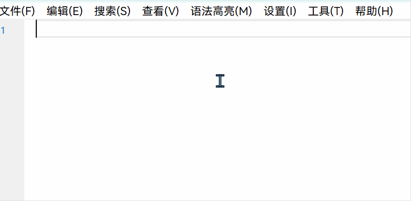

## 项目介绍

剪切板增强工具很多，但是几乎都集中于历史记录方面，比如记录存储、搜索、分类等。然而我的痛点并不在于此，因为无用的记录徒然占用空间，而有用的记录早就应该及时存储到长期笔记中。

我认为剪切板最突出的问题在于，每次只能存储一个内容，如果我需要重复使用多个内容，就必须来回复制粘贴，非常麻烦。试想一个场景，你正在写一篇医学方面的文章，需要多处使用这几个词汇：Electroencephalogram (EEG)、Electrocardiogram (ECG)、肌萎缩侧索硬化症、慢性阻塞性肺疾病，每次都要去查找、复制、粘贴。你可能会将这些词都集中到一个txt文件里，但并没有解决根本问题。

一个解决办法是绑定不同的内容到快捷键，但是存在这些问题：一是需要记忆多个快捷键，而快捷键本身是无语义的，不好记；二是系统快捷键有格式限制，必须是“修饰键+单/双字母”的形式，导致快捷键组合数量其实相当有限；三是快捷键有可能和操作系统或者其他软件冲突，所以最好不要污染全局快捷键。

另一个解决办法是通过输入法软件的自定义词汇功能，但是不同输入法软件的词汇表没有统一的格式，如果切换输入法软件，可能需要重新手动配置，或者借助一些工具来转换，甚至完全无法转换，因为不同软件的自定义词汇表功能有差异，比如支持的缩写格式、短语长度限制等等。

针对以上问题，我认为较为合理的解决方法是热词功能。顾名思义，其作用是当你输入了某个缩写词，就会自动替换为你预设的内容。比如我预设了一个热词`eeg`，当我输入`eeg`时，就会自动将其替换为`Electroencephalogram (EEG)`。它的好处显而易见，没有格式和长度限制，自然可以设置为任何你习惯或者方便记忆的组合，同时不会污染全局快捷键。

## 开发维护

当前该软件只在 X64 Windows 平台上测试过，也只提供该编译版本下载。其他架构和平台的用户请自行搭建环境进行编译，不保证在所有环境下都能正常运行。

下载地址：[hotword.zip 蓝奏云](https://wwawp.lanzouu.com/iYbws3hsuarg)

该项目主要使用Go语言开发，无图形界面，仅提供托盘菜单进行交互，因为就当前功能而论，没必要做界面。

应用体积不到5MB，可自行通过upx进一步压缩，命令为：`upx --best --lzma hotword.exe -o new.exe`，压缩后的体积在1.5MB左右。在我的个人电脑上测试，内存占用稳定在10MB左右，性能开销很低。

如果你想要更成熟的支持热词的方案，AHK语言是一个不错的选择，它功能丰富、性能极佳、使用简单，但是只适用于Windows平台。

## 使用方法

托盘菜单中，“打开目录”可直接打开程序所在目录，方便查看和编辑程序目录下的配置文件，“重载配置”用于在修改配置文件后重新加载配置，“退出应用”则退出程序。

热词配置文件存放于程序目录下的 config.txt 文件中，可通过托盘菜单选项直接打开该目录。



热词规则：

- 每个热词条目独占一行，热词和内容之间用等号隔开。
- 热词可以是任意小写字母和数字组合，虽然理论上也支持个别其他字符，但是可能引发意外情况，请尽量不要使用。
- 支持以井号（#）开头的整行注释，用于说明或禁用热词。
- 初始配置文件中已经包含了一条规则，尝试输入`hw`看看效果吧。
- 记得每次修改配置文件后，需要重启应用或者点击托盘菜单的“重载配置”选项，才能生效。

比如，你是一名编剧，正在写一部剧本，可以这样设置热词：

```txt
nv=夏慕雪
nan=令狐冲
jl=九龙御火珠
boss=脸上有疤的黑袍男子
# 女主角是夏慕雪，男主角是令狐冲，jl是名贵的法器，而boss则是大反派。
```

## 注意事项

1. 在Windows上使用时，如果托盘菜单字体模糊，可尝试的解决办法是在应用程序上依次点击“右键-属性-兼容性-更改高DPI设置-启用高DPI缩放-替代高DPI缩放行为-系统增强”。
2. 无力购买昂贵的软件证书，如果被杀毒软件误报为病毒，请自行添加到杀毒软件的白名单中。

## 一杯咖啡

我会长期维护该项目，如果您认为该项目对您有帮助，愿意支持该项目的开发，可以为我购买一杯咖啡，非常感谢！

在支付备注中输入“hw:您的QQ号”，三日内会邀请您进入讨论群，与其他用户分享使用经验、反馈问题、共同改进项目。

遵循单一职责原则，当前项目主要集中在热词上，不会添加其他功能。未来有计划开发一款简洁、轻量、多功能的桌面效率工具，敬请期待。

<p align="center">
  
</p>
